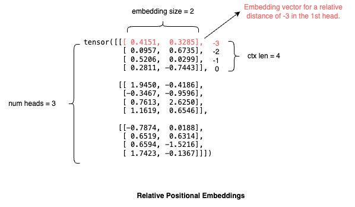

# Music Transformer
Minimal implementation of Huang et al's [music transformer](https://arxiv.org/pdf/1809.04281) in PyTorch. This readme details how you can reproduce it. Note that the paper involves two experiments but this reproduction only deals with the Piano-e-competition experiments.

- `tokenizer.py`: contains the midi tokenizer implementation + script to tokenize maestro and save it.
- `train.py`: contains model definition and training loop.
- `sample.py`: script to sample from a trained model checkpoint.

## Table of Contents
- [Writing a MIDI tokenizer](#writing-a-midi-tokenizer)
  - [Encoding](#encoding)
  - [Handling the Sustain Pedal](#handling-the-sustain-pedal)
- [Creating the Dataset](#creating-the-dataset)
  - [Defining the Training Dataloader](#defining-the-training-dataloader)
  - [Data Augmentation](#data-augmentation)
    - [Pitch Shift](#pitch-shift)
    - [Time Stretch](#time-stretch)
- [Defining the Model](#defining-the-model)
  - [Relative Positional Embeddings](#relative-positional-embeddings)
- [Training](#training)
- [Sampling](#sampling)
- [Results](#results)

## Writing a MIDI tokenizer

The paper trains a transformer architecture on tokenized MIDI data. The dataset used is the [MAESTRO](https://magenta.tensorflow.org/datasets/maestro) dataset which contains 2000 hours of professional piano performances from the International Piano-e-competition. We need to convert these MIDI files into a sequence of tokens so that we can train a transformer to predict the next token and generate new MIDI files. The tokenization scheme (proposed by [Oore et al. 2018](https://arxiv.org/abs/1808.03715)) includes the following 388 tokens:
- 128 NOTE_ON tokens: a MIDI note from 0-127 being turned on
- 128 NOTE_OFF tokens: a MIDI note from 0-127 being turned off
- 100 TIME_SHIFT tokens: a time shift in 10ms increments from 10ms to 1s.
- 32 SET_VELOCITY tokens: represents the velocity for subsequent NOTE_ON events in the form of 128 MIDI velocities binned into 32 buckets.

A sequence like this - "SET_VELOCITY<100>, NOTE_ON<60>, TIME_SHIFT<1000>, NOTE_OFF<60>" - would mean "play note 60 (middle C) for 1 second and at 100 velocity".

We also add 3 special tokens.
- 1 PAD token
- 1 SOS (start of sequence) token
- 1 EOS (end of sequence) token

This makes a total vocabulary of 391 tokens. Let's start by defining this vocabulary.

```py
note_on = [f"NOTE_ON<{i}>" for i in range(128)]
note_off = [f"NOTE_OFF<{i}>" for i in range(128)]
time_shift = [f"TIME_SHIFT<{(i + 1) * 10}>" for i in range(100)]
set_velocity = [f"SET_VELOCITY<{(i) * 4}>" for i in range(32)]
vocabulary = ['<PAD>'] + note_on + note_off + time_shift + set_velocity + ['<SOS>', '<EOS>']
vocab_size = len(vocabulary)
pad_id = 0
sos_id = vocab_size - 2
eos_id = vocab_size - 1
```
We create an array `vocabulary` who's ith index is the string representation of token i. This will allow us to translate between the token ids and their readable representation. Then we create two utility functions for this translation.
```py
ttoi = {t:i for i, t in enumerate(vocabulary)}
itot = {i:t for i, t in enumerate(vocabulary)}
tok_to_id = lambda x: [ttoi[t] for t in x]
id_to_tok = lambda x: [itot[i] for i in x]
```
Now we can do things like this:
```py
id_to_tok([382, 61, 356, 189])
# ['SET_VELOCITY<100>', 'NOTE_ON<60>', 'TIME_SHIFT<1000>', 'NOTE_OFF<60>']
tok_to_id(['SET_VELOCITY<100>', 'NOTE_ON<60>', 'TIME_SHIFT<1000>', 'NOTE_OFF<60>'])
# [382, 61, 356, 189]
```
Of course the model we are training will never see the string representations, just the token_ids. The string representations are used for debugging and the tokenizer decode function.

### Encoding

Now we can write the encode function. This function should take in a path to a midi file and return a list of integer token_ids. I chose to use the [mido](https://mido.readthedocs.io/en/stable/) library for reading and writing midi files.

We start by initializing a MidiFile object with the filename. This will allow us to work with the midi file as an object
```py
from mido import MidiFile

def encode(filename):
    # read midi file as object
    mid = MidiFile(filename)
```
Let's print `mid` to see what the object looks like.

```
MidiFile(type=1, ticks_per_beat=480, tracks=[
  MidiTrack([
    MetaMessage('set_tempo', tempo=500000, time=0),
    MetaMessage('time_signature', numerator=4, denominator=4, clocks_per_click=24, notated_32nd_notes_per_beat=8, time=0),
    MetaMessage('end_of_track', time=1)]),
  MidiTrack([
    Message('program_change', channel=0, program=0, time=0),
    Message('control_change', channel=0, control=64, value=110, time=0),
    Message('control_change', channel=0, control=67, value=117, time=0),
    Message('control_change', channel=0, control=64, value=114, time=490),
    Message('control_change', channel=0, control=64, value=118, time=94),
    Message('control_change', channel=0, control=67, value=121, time=75),
    Message('control_change', channel=0, control=64, value=122, time=262),
    Message('note_on', channel=0, note=71, velocity=60, time=128),
    Message('control_change', channel=0, control=67, value=117, time=37),
    Message('control_change', channel=0, control=67, value=113, time=55),
    Message('note_on', channel=0, note=71, velocity=0, time=1),
    Message('control_change', channel=0, control=64, value=111, time=41),
    Message('control_change', channel=0, control=64, value=93, time=19),
    Message('control_change', channel=0, control=64, value=76, time=17),
    Message('note_on', channel=0, note=55, velocity=44, time=9),
    Message('note_on', channel=0, note=71, velocity=54, time=9),
    Message('control_change', channel=0, control=64, value=65, time=1),
    Message('control_change', channel=0, control=67, value=108, time=1),
    Message('control_change', channel=0, control=64, value=60, time=19),
...
    Message('control_change', channel=0, control=64, value=40, time=20),
    Message('control_change', channel=0, control=64, value=36, time=92),
    MetaMessage('end_of_track', time=1)])
])
```
Explaining the midi standard in detail isn't in the scope of this article, but basically know that a midi file has some metadata and some tracks. Each track consists of a series of messages which can either contain metadata or song information. Messages that contain song information will be things like 'note_on' to control notes, or 'control_change' to control things like the pedals. Each message has attributes. For example the note_on message has a note attribute to specify the midi note being turned on (in the range [0, 127]), a velocity attribute, and a time attribute to specify the space of time in ticks between this message and the last. A note_on event with a velocity of 0 is equivalent to a note_off event.

Knowing this we can write the encode function. We want to convert the note_on messages with non-zero velocity into our corresponding NOTE_ON token, the note_on events with zero velocity into our NOTE_OFF token, and the time attribute should be expressed as our TIME_SHIFT tokens to encode the time between events. We also want to use the SET_VELOCITY token to encode the velocity information for NOTE_ON tokens.

First we read the `ticks_per_beat` which specifies how many ticks are in one quarter note. In the midi standard, time is measured in ticks which is a subdivision of the beat. Next we read the tempo from the first track of the midi file by looping through `mid.tracks[0]`. Tempo in midi is expressed in microseconds per quarter note. Using the `ticks_per_beat` and `tempo` we can convert from ticks to microsecond which will be useful later. Finally we define `elapsed` to keep track of elapsed ticks between messages and `tokens` to hold our final output.

```py
from mido import MidiFile

def encode(filename):
    # read midi file as object
    mid = MidiFile(filename)

    # read file metadata
    ticks_per_beat = mid.ticks_per_beat
    tempo = 0
    for msg in mid.tracks[0]:
        if msg.is_meta and msg.type == 'set_tempo':
            tempo = msg.tempo
    
    # set up counter variables
    elapsed = 0
    tokens = []
```
Now we can start looping through the main track and converting the midi messages to tokens.
```py
from mido import MidiFile

def encode(filename):
    # read midi file as object
    mid = MidiFile(filename)

    # read file metadata
    ticks_per_beat = mid.ticks_per_beat
    tempo = 0
    for msg in mid.tracks[0]:
        if msg.is_meta and msg.type == 'set_tempo':
            tempo = msg.tempo
    
    # set up counter variables
    elapsed = 0
    tokens = []

    # keep track of last velocity
    last_vel = -1

    # loop through main track
    for msg in mid.tracks[1]:
        msg_t = msg.type
        if msg_t == 'note_on' and msg.velocity > 0:
            if last_vel != msg.velocity:
                vel_bin = msg.velocity // 4
                tokens.append(1 + 128 + 128 + 100 + vel_bin) # SET_VELOCITY token
                last_vel = msg.velocity
            tokens.append(1 + msg.note) # NOTE_ON token
        elif msg_t == 'note_off' or (msg_t == 'note_on' and msg.velocity == 0):
            tokens.append(1 + 128 + msg.note) # NOTE_OFF token
```
Notice that when appending the token we have to ensure it is the correct id. For example, to get a NOTE_OFF token for note `n` we have to do `1 + 128 + n` to account for the 1 padding token and the 128 NOTE_ON tokens that precede NOTE_OFF in the vocabulary.

We still need to handle converting the midi time attribute to TIME_SHIFT tokens. Remember, the time attribute specifies the number of ticks since the last message. However, our TIME_SHIFT tokens are in milliseconds so we need a way to convert a number of ticks into milliseconds and then into a series of TIME_SHIFT tokens. First we create helper functions to convert from ticks to milliseconds. This is where the ticker_per_beat and tempo that we saved earlier come into play.

```py
def ticks_to_ms(ticks, ticks_per_beat, tempo):
    return (ticks / ticks_per_beat) * tempo / 1000
```
Next we define a function that converts ticks to a sequence of TIME_SHIFT tokens.
```py
def elapsed_to_tokens(elapsed_ticks, ticks_per_beat, tempo):
    res = []
    # convert ticks to ms
    elapsed_ms = int(ticks_to_ms(elapsed_ticks, ticks_per_beat, tempo))

    # use as many of the largest TIME_SHIFT token as possible
    max_shift = 1000
    if elapsed_ms >= max_shift:
        res.extend([128 + 128 + 100] * (elapsed_ms // max_shift))
        elapsed_ms %= max_shift
    
    # deal with the remaining time
    remaining_shift_id = (elapsed_ms // 10)
    if remaining_shift_id > 0:
        res.append(128 + 128 + remaining_shift_id)
    return res
```
First we find the `elapsed_ms` using the helper function. Then we try to fit as many of the TIME_SHIFT<1000> tokens as possible because that is the largest TIME_SHIFT token we have. Then we express the remaining time as the nearest TIME_SHIFT token we have from 10-990.

Using these two function we can modify `encode()`:

```py
from mido import MidiFile

def encode(filename):
    # read midi file as object
    mid = MidiFile(filename)

    # read file metadata
    ticks_per_beat = mid.ticks_per_beat
    tempo = 0
    for msg in mid.tracks[0]:
        if msg.is_meta and msg.type == 'set_tempo':
            tempo = msg.tempo
    
    # set up counter variables
    elapsed = 0
    tokens = []

    # keep track of last velocity
    last_vel = -1

    # loop through main track
    for msg in mid.tracks[1]:
        msg_t = msg.type
        elapsed += msg.time
        if msg_t == 'note_on' and msg.velocity > 0:
            tokens += elapsed_to_tokens(elapsed, ticks_per_beat, tempo) # TIME_SHIFT
            elapsed = 0 # reset elapsed variable
            if last_vel != msg.velocity:
                vel_bin = msg.velocity // 4
                tokens.append(1 + 128 + 128 + 100 + vel_bin) # SET_VELOCITY token
                last_vel = msg.velocity
            tokens.append(1 + msg.note) # NOTE_ON
        elif msg_t == 'note_off' or (msg_t == 'note_on' and msg.velocity == 0):
            tokens += elapsed_to_tokens(elapsed, ticks_per_beat, tempo)
            elapsed = 0
            tokens.append(1 + 128 + msg.note) # NOTE_OFF
    return tokens
```
For each message we accumulate the elapsed ticks into the `elapsed` variable. Before we append any token, we need to append the appropriate TIME_SHIFT tokens based on the elapsed ticks accumulated. Then we reset the `elapsed` variable and start accumulating elapsed ticks again.

### Handling the Sustain Pedal
You might have noticed that the midi object we printed earlier contained a lot of control_change messages. Control_change messages are used to encode various non-note related things, such as pedal behavior. Any control_change message with `control=64` is a sustain pedal event which we want to account for. Since the vocabulary has no pedal tokens the authors chose to simulate the effect of the sustain pedal. They preprocessed the data as follows: when the pedal is down, all notes are extended until the pedal is lifted or until the note is played again. If the note's duration extends beyond when the pedal is lifted it remained unchanged. Here's how we implement that in our tokenizer.

```py
def encode(filename):
    # read midi file as object
    mid = MidiFile(filename)

    # read file metadata
    ticks_per_beat = mid.ticks_per_beat
    tempo = 0
    for msg in mid.tracks[0]:
        if msg.is_meta and msg.type == 'set_tempo':
            tempo = msg.tempo
    
    # set up counter variables
    elapsed = 0
    tokens = []

    # keep track of last velocity
    last_vel = -1

    # keep track of sustained notes and pedal state
    sustained_notes = [0 for i in range(128)] # 1 if sustained, else 0
    pedal_down = False

    # loop through main track
    for msg in mid.tracks[1]:
        msg_t = msg.type
        elapsed += msg.time
        if msg_t == 'control_change' and msg.control == 64: # sustain pedal event
            pedal_down = (msg.value >= 64)
            if not pedal_down: # pedal lifted
                # end all the sustained notes
                for i in range(len(sustained_notes)):
                    if sustained_notes[i]:
                        tokens += elapsed_to_tokens(elapsed, ticks_per_beat, tempo) # TIME_SHIFT
                        elapsed = 0
                        tokens.append(1 + 128 + i) # NOTE_OFF
                        sustained_notes[i] = 0
        elif msg_t == 'note_on' and msg.velocity > 0:
            # end currently sustained notes if they are pressed again
            if sustained_notes[msg.note]:
                tokens += elapsed_to_tokens(elapsed, ticks_per_beat, tempo) # TIME_SHIFT
                elapsed = 0
                tokens.append(1 + 128 + msg.note) # NOTE_OFF
                sustained_notes[msg.note] = 0 # remove ended note from pedal notes
            tokens += elapsed_to_tokens(elapsed, ticks_per_beat, tempo) # TIME_SHIFT
            elapsed = 0 # reset elapsed variable
            if last_vel != msg.velocity:
                vel_bin = msg.velocity // 4
                tokens.append(1 + 128 + 128 + 100 + vel_bin) # SET_VELOCITY token
                last_vel = msg.velocity
            tokens.append(1 + msg.note) # NOTE_ON
        elif msg_t == 'note_off' or (msg_t == 'note_on' and msg.velocity == 0):
            if pedal_down: # if a note ends while pedal is down, mark as being sustained
                sustained_notes[msg.note] = 1
            else:
                tokens += elapsed_to_tokens(elapsed, ticks_per_beat, tempo)
                elapsed = 0
                tokens.append(1 + 128 + msg.note) # NOTE_OFF
    return tokens
```
The notes currently being sustained are tracked using an array where the ith index is 1 if note i is being sustained. Then we look for note_off events that occur while the pedal is down and flag these as being sustained, instead of appending a NOTE_OFF token right away. Instead, the NOTE_OFF token is appended later when the pedal is lifted or the note is pressed again.

Next we define a decode function to convert our tokens back to a midi file. We will use this later during inference. We also define a function to convert milliseconds back to ticks which we need to write the midi file.
```py
from mido import Message, MidiFile, MidiTrack, MetaMessage

def ms_to_ticks(ms, ticks_per_beat, tempo):
    return int((ms * 1000) / tempo * ticks_per_beat)

def decode(tokens, filename):
    mid = MidiFile()
    track1 = MidiTrack()
    mid.tracks.append(track1)
    vel = 0
    elapsed_ms = 0
    for tok in id_to_tok(tokens):
        if "PAD" in tok:
            print("error pad encountered")
            break
        if "SOS" in tok or "EOS" in tok:
            print("eos/sos encountered")
            break
        value = int(tok.strip(string.ascii_letters + '_<>'))
        if 'SET_VELOCITY' in tok:
            vel = value
        elif 'TIME_SHIFT' in tok:
            elapsed_ms += value
        elif 'NOTE_ON' in tok:
            track1.append(Message('note_on', note=value, velocity=vel, time=ms_to_ticks(elapsed_ms, 480, 500000)))
            elapsed_ms = 0
        elif 'NOTE_OFF' in tok:
            track1.append(Message('note_off', note=value, velocity=vel, time=ms_to_ticks(elapsed_ms, 480, 500000)))
            elapsed_ms = 0
    mid.save(filename)
    print(f"saved to {filename}")
    return mid
```
This involes using `id_to_tok()` to convert to tokens_ids to string representations which we can then create the appropriate midi messages from. Now we are ready to start creating the dataset.

## Creating the Dataset
The Maestro dataset has predefined train, validation, and test splits which we will use. Information about each file including what split it should be in is specified in "maestro-v3.0.0.csv". We will use pandas to read the csv file and get a list of file names for each split.
```py
import pandas as pd

maestro = pd.read_csv('maestro-v3.0.0/maestro-v3.0.0.csv')
midi_paths_train = maestro[maestro['split'] == 'train']['midi_filename'].tolist()
midi_paths_valid = maestro[maestro['split'] == 'validation']['midi_filename'].tolist()
midi_paths_test = maestro[maestro['split'] == 'test']['midi_filename'].tolist()
```
Next we encode all the files in each split into one long list of tokens for that split. Even though we append all the tokens to one list, the files will be marked by start-of-sequence (SOS) and end-of-sequence (EOS) tokens.
```py
train_data = []
valid_data = []
ctx_len = 2048
root = 'maestro-v3.0.0/'

for filename in midi_paths_train:
        train_data.append(sos_id)
        tokens = encode(f"{DATASET_PATH}/{filename}")
        train_data.extend(tokens)
        train_data.append(eos_id)

for filename in midi_paths_valid:
    valid_data.append(sos_id)
    tokens = encode(f"{DATASET_PATH}/{filename}")
    valid_data.extend(tokens)
    valid_data.append(eos_id)

train_data = torch.tensor(train_data)
```

The training data will remain as a single long list of tokens because we will sample random sequences during training. The validation data gets reshaped according to the context length ahead of time, because we won't sample randomly from it.

```py
valid_data = torch.tensor(valid_data)
valid_data = valid_data[:(valid_data.shape[0] // (ctx_len + 1)) * (ctx_len + 1)]
valid_data = valid_data.view(-1, ctx_len + 1)
```
After this operation `valid_data` will be of shape (num_valid_examples, 2049). The reason we want the example length at this stage to be  `ctx_len + 1` is that the label for each example will be the input shifted left (to get the next token for each position). That way once we do the left shift we will have an input and label of length 2048.

### Defining the Training Dataloader
The authors train on random sequences of length 2048. So, we need to define a dataloader function to sample random sequences from our list of training tokens and stack them into a batch.

```py
def get_batch(batch_size):
    idxs = torch.randint(0, train_data.shape[0] - (ctx_len + 1), (batch_size,1))
    idxs = idxs + torch.arange(ctx_len + 1)
    batch = train_data[idxs]
```
The first thing we do is sample batch_size number of random indices from train_data using `torch.randint()` and store them in `idxs`. These `idxs` will be the start index of each sequence we sample. Right now idxs is a column vector of shape (batch_size, 1) where each row contains only the start index of each sequence. However, we want all the indices for each sequence. So we use a broadcasting trick where we add `torch.arange(ctx_len + 1)` to get a 2d tensor of shape (batch_size, ctx_len + 1) where each row is the indices for a training sequence. For example:
```py
batch_size = 3
idxs = tensor([[4],
               [2],
               [7]])
# column gets broadcasted across last dimension
idxs + torch.arange(3 + 1) = tensor([[ 4,  5,  6,  7],
                                     [ 2,  3,  4,  5],
                                     [ 7,  8,  9, 10]])
```
Now we can use `idxs` to index `train_data` and get a batch of randomly sample sequences. Again, the reason why we want these sequences to be of length `ctx_len + 1` is because the labels for the sequence will be the sequence itself shifted to the left, and after shifting it will be the correct length.

The authors also perform data augmentation.

### Data Augmentation
The authors perform two types of data augmentation:
1. Pitch shifts uniformly sampled from {-3, -2, ... , 2, 3}.
2. Time stretches uniformly sampled from {0.95, 0.975, 1.0, 1.025, 1.05}.
```py
pitch_shifts = np.arange(-3, 4)
time_stretches = np.array([0.95, 0.975, 1.0, 1.025, 1.05])
```
#### Pitch Shift
```py
shifts = torch.tensor(np.random.choice(pitch_shifts, batch.shape[0])).view(-1, 1).expand_as(batch)
stretches = np.random.choice(time_stretches, batch.shape[0])
```
We start by sampling a pitch shift value for each row in the batch using `np.random.choice()`. We reshape the output into a column vector. Then we use `expand_as()` to copy the column vector to match the shape of the batch. This leaves us with a matrix `shifts` which we can add to train data to shift each row by a certain amount.

However we don't want to shift every token in each row, only NOTE_ON and NOTE_OFF tokens. Therefore we use a mask to set `shifts` to zero in every position which does not correspond to a NOTE_ON or NOTE_OFF token.
```py
note_mask = (batch >= 1) & (batch <= 128 + 128)
shifted_data = batch + shifts.masked_fill(~note_mask, 0)
```
#### Time Stretch
Time stretch augmentation involves changing tokens. We need to loop through the token sequence and count up the TIME_SHIFT tokens between events. Then we need to multiply this elapsed time by a stretch multiplier, and convert it back into TIME_SHIFT tokens. We define a helper function `elapsedms_to_tokens()` to convert between milliseconds and tokens since we are no longer working with ticks. 
```py
def elapsedms_to_tokens(elapsed_ms):
    res = []
    max_shift = 1000
    if elapsed_ms >= max_shift:
        res.extend([128 + 128 + 100] * (elapsed_ms // max_shift))
        elapsed_ms %= max_shift
    remaining_shift_id = (elapsed_ms // 10)
    if remaining_shift_id > 0:
        res.append(128 + 128 + remaining_shift_id)
    return res

stretched_data = []
    for i, seq in enumerate(shifted_data):
        elapsed_ms = 0
        stretched_seq = []
        for tok_id in seq.tolist():
            if (1 + 128 + 128 <= tok_id < 1 + 128 + 128 + 100): # time shift
                elapsed_ms += (tok_id - (1 + 128 + 128) + 1) * 10
            else:
                stretched_seq += elapsedms_to_tokens(math.ceil(elapsed_ms * stretches[i]))
                stretched_seq.append(tok_id)
                elapsed_ms = 0
        stretched_seq += elapsedms_to_tokens(elapsed_ms)
        stretched_data.append(torch.tensor(stretched_seq))
```
Then we loop through each row of the shifted data, maintaining a list `stretched_seq` which will be the new stretched sequence. For each token_id in the sequence, if it a TIME_SHIFT token we accumulate it's milliseconds in the `elapsed_ms` variable. When we find a non TIME_SHIFT token we scale `elapsed_ms` according to the multiplier we sampled earlier, and then convert back to tokens. Then we append the non TIME_SHIFT token and reset `elapsed_ms`. We repeat this for every row to finish augmenting the batch. Here it is all together:

```py
def elapsedms_to_tokens(elapsed_ms):
        res = []
        max_shift = 1000
        if elapsed_ms >= max_shift:
            res.extend([128 + 128 + 100] * (elapsed_ms // max_shift))
            elapsed_ms %= max_shift
        remaining_shift_id = (elapsed_ms // 10)
        if remaining_shift_id > 0:
            res.append(128 + 128 + remaining_shift_id)
        return res

def get_batch(batch_size):
    # sample batch
    idxs = torch.randint(0, train_data.shape[0] - (ctx_len + 1), (batch_size,1))
    idxs = idxs + torch.arange(ctx_len + 1)
    batch = train_data[idxs]

    # random augmentation
    pitch_shifts = np.arange(-3, 4)
    time_stretches = np.array([0.95, 0.975, 1.0, 1.025, 1.05])
    shifts = torch.tensor(np.random.choice(pitch_shifts, batch.shape[0])).view(-1, 1).expand_as(batch)
    stretches = np.random.choice(time_stretches, batch.shape[0])
    
    # shift
    note_mask = (batch >= 1) & (batch <= 128 + 128)
    shifted_data = batch + shifts.masked_fill(~note_mask, 0)
    
    # stretch
    stretched_data = []
    for i, seq in enumerate(shifted_data):
        elapsed_ms = 0
        tok_cnt = []
        stretched_seq = []
        for idx in seq.tolist():
            if (1 + 128 + 128 <= idx < 128 + 128 + 100): # time shift
                elapsed_ms += (idx - (1 + 128 + 128) + 1) * 10
                tok_cnt.append(idx)
            else:
                stretched_seq += elapsedms_to_tokens(math.ceil(elapsed_ms * stretches[i]))
                stretched_seq.append(idx)
                elapsed_ms = 0
                tok_cnt = []
        stretched_seq += elapsedms_to_tokens(elapsed_ms)
        stretched_data.append(torch.tensor(stretched_seq))

    # pad
    aug_batch = nn.utils.rnn.pad_sequence(stretched_data, batch_first=True, padding_value=pad_id)[:, :ctx_len + 1]
    return aug_batch.to(device)
```
Note that before returning the augmented batch, we need to pad each row to be the same length using `rnn.pad_sequence()` because the stretching may have changed the length of some rows. Then we slice it to our desired length and return.

## Defining the Model
Now we can define the model. We'll start with a basic decoder-only transformer architecture. This article assumes knowledge about this architecture and will only cover implementation of relative global attention. If you don't know anything about transformers I recommend Kaparthy's [GPT from scratch video](https://www.youtube.com/watch?v=kCc8FmEb1nY) and my own article [here](https://github.com/pranavjad/mlx-gpt2).

Here is the base transformer implementation:
```py
### Vanilla Decoder-only Transformer

n_emb = 256
n_layers = 6
n_heads = 8
dropout = 0.1
head_size = 256
filter_size = 1024
ctx_len = 2048

device = torch.device("cuda:0")

class MLP(nn.Module):
    def __init__(self):
        super().__init__()
        self.c_fc = nn.Linear(n_emb, filter_size)
        self.relu = nn.ReLU()
        self.c_proj = nn.Linear(filter_size, n_emb)
        self.dropout = nn.Dropout(dropout)
    
    def forward(self, x):
        x = self.relu(self.c_fc(x))
        x = self.c_proj(x)
        x = self.dropout(x)
        return x

class MultiHeadAttention(nn.Module):
    def __init__(self):
        super().__init__()
        self.c_attn = nn.Linear(n_emb, head_size * 3, bias=False)
        tril = torch.tril(torch.ones(ctx_len, ctx_len))
        self.register_buffer('causal_mask', torch.zeros(ctx_len, ctx_len, requires_grad=False).masked_fill(tril == 0, -1e9))
        self.attn_dropout = nn.Dropout(dropout)
        self.c_proj = nn.Linear(head_size, n_emb)
        self.resid_dropout = nn.Dropout(dropout)
    
    def forward(self, x, mask=None):
        B, T, C = x.shape
        K, Q, V = self.c_attn(x).split(head_size, dim=-1)
        K = K.view(B, T, n_heads, head_size // n_heads).transpose(1, 2)
        Q = Q.view(B, T, n_heads, head_size // n_heads).transpose(1, 2)
        V = V.view(B, T, n_heads, head_size // n_heads).transpose(1, 2)
        attn_weights = (Q @ K.mT) / math.sqrt(Q.shape[-1])
        attn_weights = attn_weights + self.causal_mask[:T, :T]
        attn_weights = torch.softmax(attn_weights, dim=-1)
        if mask is not None: # padding mask
            attn_weights = attn_weights * mask
        attn_weights = self.attn_dropout(attn_weights)
        out = attn_weights @ V
        out = out.transpose(1, 2).reshape(B, T, head_size)
        out = self.resid_dropout(self.c_proj(out))
        return out

class Block(nn.Module):
    def __init__(self):
        super().__init__()
        self.mhra = MultiHeadAttention()
        self.mlp = MLP()
        self.ln_1 = nn.LayerNorm(n_emb)
        self.ln_2 = nn.LayerNorm(n_emb)
    
    def forward(self, x, mask=None):
        x = x + self.mhra(self.ln_1(x), mask)
        x = x + self.mlp(self.ln_2(x))
        return x

def create_padding_mask(batch):
    B, T = batch.shape
    # 0s in mask positions, 1s in other positions
    mask = torch.eq(batch, pad_id).unsqueeze(1)
    mask = ~(mask | mask.mT)
    mask = mask.view(B, 1, T, T)
    return mask.float().to(device)

class MusicTransformer(nn.Module):
    def __init__(self):
        super().__init__()
        self.wte = nn.Embedding(vocab_size, n_emb)

        factor = 10000 ** (-torch.arange(0, n_emb, 2) / n_emb)
        pos = torch.arange(ctx_len).unsqueeze(1)
        sin_in = pos * factor
        pe = torch.zeros(ctx_len, n_emb)
        pe[:,0::2] = torch.sin(sin_in)
        pe[:,1::2] = torch.cos(sin_in)
        self.wpe = pe.to(device)
        self.wpe.requires_grad = False

        self.blocks = nn.ModuleList([Block() for _ in range(n_layers)])
        self.ln_1 = nn.LayerNorm(n_emb)
        self.head = nn.Linear(n_emb, vocab_size)
        self.loss_fn = nn.CrossEntropyLoss(label_smoothing=0.0)
        self.input_dropout = nn.Dropout(dropout)
        param_cnt = sum([p.numel() for p in self.parameters()])
        print(f'{param_cnt/1e6:.3f}M parameters')
    
    def forward(self, x, mask=None):
        B, T = x.shape
        mask = create_padding_mask(x)
        tok_emb = self.wte(x)
        tok_emb *= math.sqrt(n_emb)
        pos_emb = self.wpe[:T]
        x = tok_emb + pos_emb
        x = self.input_dropout(x)
        for block in self.blocks:
            x = block(x, mask)
        x = self.ln_1(x)
        logits = self.head(x)
        return logits
    
    def loss(self, x, y):
        mask = (y != pad_id).to(device)
        unmasked_length = mask.int().sum()
        logits = self(x).permute(0, 2, 1)
        loss = self.loss_fn(logits, y) * mask
        return loss.sum() / unmasked_length
    
    def accuracy(self, x, y):
        unmasked_length = (y != pad_id).int().sum().to(device)
        logits = self(x)
        total_correct = (logits.argmax(-1).view(-1) == y.view(-1)).sum()
        return total_correct / unmasked_length
    
    def sample(self, max_new_tokens):
        ctx = torch.zeros((1, 1), dtype=torch.int32).to(device)
        for _ in range(max_new_tokens):
            logits = self(ctx[:, -ctx_len:])
            probas = torch.softmax(logits, -1)[:, -1, :]
            next_tok = torch.multinomial(probas, 1)
            if next_tok == 0:
                return ctx
            ctx = torch.concat((ctx, next_tok), dim=1)
        return ctx
```
### Relative Positional Embeddings
The vanilla transformer relies on sinusoidal positional embeddings to inject positional information into the embedding vectors before going to the transformer blocks. The authors found that using relative positional embeddings within the attention heads in addition to the sinusoidal positional embeddings allows the model to better capture complex musical relationships. Relative positional embeddings involves learning an embedding tensor of shape (H, L, D_h) where H=num_heads, L=ctx_len, and D_h=head_size. The point of relative position embeddings is to encode information about relative distances between tokens.



Here is an example of a relative positional embeddings tensor. Each head has it's own embedding matrix so the first dimension is equal to the number of heads. Each embedding matrix has a row for every relative distance. Since we only want to account for previous tokens when predicting future tokens, we only have non-positive relative distances.

The way these embeddings inject relative positional information into the attention calculation is through matrix multiplication with the query projection. This results in a matrix which we can add to the attention weights to inject relative positional information. The following diagram illustrates how.


After transposing `pos_embs` over the last two dimensions, we can perform a batched matrix multiplication with the query projection to get `S_rel`. The matrices in `S_rel` are of shape (ctx_len, ctx_len) similar to the attention weights, because they quantify the positional interaction between each pair of tokens. Because of how the matrix multiply works, each position in `S_rel` is the dot product of some row of `query` with some column of `pos_embs`. This means each position can be interpreted as quantifying the positional interaction between a token and another token a certain distance away from it. `S_rel` will be added to the attention weights to inject the relative position information.

However, there's still one issue - some of our embeddings are not possible. For example the top left entry in `S_rel` represents the interaction between token 0 and the token -3 positions away. This makes no sense because token 0 is the first token, there is nothing before it. This value in `S_rel` should be 0. In fact, you'll notice that the upper left entries of each of these matrices should be 0. Therefore we mask these entries.


Now all of the entries in `S_rel` are valid. But before we can add them to the attention weights we need to renconcile the difference in how the two tensors are indexed. The rows of `S_rel` represent absolute positions and the columns represent relative positions. However, for the attention weights both the rows and columns represent absolute positions: i.e. the entry (1, 3) in the attention weights corresponds to the interaction between token 1 and token 3. In `S_rel` the entry (1, 3) corresponds to the interaction between token 1 and the token 0 positions away (itself). In order to make everything align we simply need to slide everything to the left:


The authors refer to this operation as "skewing". You'll now notice `S_rel` is indexed absolutely in both rows and columns as we wanted. Using our previous example, the (1, 3) value from the original `S_rel` is now at the (1, 1) position after skewing - exactly what we expected since it encodes the interaction between token 1 and itself.

In practice, the skewing operation is implemented as follows:


It's a neat trick that relies on the way reshaping works. We add a column of zeros, and then reshape the matrix to switch the sizes of the last two dimensions. Note that this is not the same as transposing the last two dimensions.

Now let's edit our attention implementation to make it relative attention.
```py
class MultiHeadRelativeAttention(nn.Module):
    def __init__(self):
        super().__init__()
        self.c_attn = nn.Linear(n_emb, head_size * 3, bias=False)
        # Positional embeddings
        self.pos_embs = nn.Parameter(torch.randn(n_heads, ctx_len, n_emb) * 0.02)
        tril = torch.tril(torch.ones(ctx_len, ctx_len))
        self.register_buffer('causal_mask', torch.zeros(ctx_len, ctx_len, requires_grad=False).masked_fill(tril == 0, -1e9))
        self.attn_dropout = nn.Dropout(dropout)
        self.c_proj = nn.Linear(head_size, n_emb)
        self.resid_dropout = nn.Dropout(dropout)
    
    def forward(self, x, mask=None):
        B, T, C = x.shape
        K, Q, V = self.c_attn(x).split(head_size, dim=-1)
        K = K.view(B, T, n_heads, head_size // n_heads).transpose(1, 2)
        Q = Q.view(B, T, n_heads, head_size // n_heads).transpose(1, 2)
        V = V.view(B, T, n_heads, head_size // n_heads).transpose(1, 2)
        
        # S_rel calculation
        S_rel = (Q @ self.pos_embs[:, -T:, :].mT)
        S_rel = S_rel * torch.tril(torch.ones(T, T)).flip(1).to(device) # mask out-of-bounds positions
        S_rel = S_rel = torch.cat((torch.zeros(B, n_heads, T, 1).to(device), S_rel), dim=-1).reshape(B, n_heads, T + 1, T) # pad and reshape
        S_rel = S_rel[..., 1:, :] # remove first row

        attn_weights = ((Q @ K.mT) + S_rel) / math.sqrt(Q.shape[-1])
        attn_weights = attn_weights + self.causal_mask[:T, :T]
        attn_weights = torch.softmax(attn_weights, dim=-1)
        if mask is not None: # padding mask
            attn_weights = attn_weights * mask
        attn_weights = self.attn_dropout(attn_weights)
        out = attn_weights @ V
        out = out.transpose(1, 2).reshape(B, T, head_size)
        out = self.resid_dropout(self.c_proj(out))
        return out
```
The first step to the calculating `S_rel` is to multiply the queries by the positional embeddings transposed over the last two dimensions (achieved by `.mT`). Also notice we slice `pos_embs` to only include the last `T` embeddings where `T` is the sequence length. This is because during inference, we won't need the whole embedding table. For example if we start sampling with the `<SOS>` token, we will only have one token as context so we only have one relative position to embed. The reason why we take the last `T` embeddings instead of the first is because of our convention that the embedding table represents the relative positions `[-ctx_len+1, 0]` from top to bottom.

Then we use `torch.tril` and `flip` to generate a mask that zeros out the out-of-bounds interactions mentioned earlier. Then we concatenate a column of zeros and reshape to achieve the skewed tensor. Finally we remove the excess row of zeros and we are ready to add to our attention weights. That's it for implementing relative attention! More specifically, this is relative global attention because we attend to the entire sequence. The authors also experimented with relative local attention which involves splitting up attention into chunks. I won't go into detail on that here, but I encourage anyone interested to read the paper.

## Training
With the model and data ready, we can write the training loop. I use wandb for logging.

```py
# Hyperparameters
batch_size = 16
lr = 0
lr_factor = 1
step = 1
warmup_steps = 4000
weight_decay = 0.01
grad_clip = 1.0

# Ready validation data
valid_data = valid_data.to(device)
valid_ds = TensorDataset(valid_data[:, :-1], valid_data[:, 1:])
valid_loader = DataLoader(valid_ds, batch_size=batch_size, shuffle=False)

# Define model
model = MusicTransformer()
param_groups = model.parameters()

# Weight Decay
decay_params = []
no_decay_params = []
for name, param in model.named_parameters():
if 'ln' in name:
    no_decay_params.append(param)
else:
    decay_params.append(param)
param_groups = [
{'params': no_decay_params, 'weight_decay': 0.0},  # No weight decay for LayerNorm
{'params': decay_params, 'weight_decay': weight_decay}  # Weight decay for other parameters
]

# Define optimizer and compile model for efficiency boost
optimizer = optim.AdamW(param_groups, lr=lr, betas=(0.9, 0.98), eps=1e-9)
model = model.to(device)
model = torch.compile(model)
torch.set_float32_matmul_precision("high")

# wandb for logging
wandb.login(key="your-api-key")
run = wandb.init(
project="project-name",
name="music-transformer",
config = {
    "n_emb": n_emb,
    "n_layers": n_layers,
    "n_heads": n_heads,
    "dropout": dropout,
    "head_size": head_size,
    "filter_size": filter_size,
    "ctx_len": ctx_len,
    "weight_decay": weight_decay,
    "grad_clip": grad_clip,
    "warmup_steps": warmup_steps,
}
)

# Calculate loss and accuracy on evaluation dataset
def run_eval():
model.eval()
running_loss = 0
running_acc = 0
num_val_batches = len(valid_loader)
for input, label in valid_loader:
    loss = model.loss(input, label)
    running_acc += model.accuracy(input, label)
    running_loss += loss.item()
avg_valid_loss = running_loss / num_val_batches
avg_valid_acc = running_acc / num_val_batches
return avg_valid_loss, avg_valid_acc

steps = int(1e6)
eval_steps = 1000
best_val_loss = 1e9
for step in range(steps):
# learning rate schedule
if step > 0:
    lr = lr_factor * (n_emb ** -0.5) * min(step ** -0.5, step * warmup_steps ** -1.5)
    for p in optimizer.param_groups:
        p['lr'] = lr

if (step % eval_steps == 0):
    loss, acc = run_eval()
    # save best model
    if loss < best_val_loss:
        best_val_loss = loss
        torch.save({
            'lr': lr,
            'step': step,
            'model_state_dict': model.state_dict(),
            'optimizer_state_dict': optimizer.state_dict(),
            }, 
            f"checkpoint_best.pt"
        )
    wandb.log({"val/loss": loss, "val/accuracy": acc, "step": step})
    # save model checkpoint
    torch.save({
        'lr': lr,
        'step': step,
        'model_state_dict': model.state_dict(),
        'optimizer_state_dict': optimizer.state_dict(),
        }, 
        f"checkpoint.pt"
    )

# training step
batch = get_batch(batch_size)
input = batch[:, :-1]
label = batch[:, 1:] # labels are inputs shifted left
optimizer.zero_grad()
loss = model.loss(input, label)
loss.backward()
torch.nn.utils.clip_grad_norm_(model.parameters(), grad_clip)
optimizer.step()
wandb.log({"train/loss": loss.item(), "lr": lr, "step": step})
```

# Sampling
The following method is used to sample from the model with control over temperature and top_k parameters.

```py
def sample(self, start_token_id, max_new_tokens, temp=1.0, topk=20):
    ctx = torch.ones((1, 1), dtype=torch.int32).to(device) * start_token_id
    for _ in range(max_new_tokens):
        logits = self(ctx[:, -ctx_len:])[:, -1, :]
        topk_logits, topk_idxs = torch.topk(logits, topk, dim=-1)
        probas = torch.softmax(topk_logits / temp, -1)
        next_tok = topk_idxs[0, torch.multinomial(probas, 1).item()]
        if next_tok == 0:
            return ctx
        ctx = torch.concat((ctx, next_tok.view(1, 1)), dim=1)
    return ctx
```

See `sample.py` for the full script to load a checkpoint, sample from the model, and save to a midi file.

# Results
With the settings in `train.py` (~10M params) my run achieved a train loss of 1.71 and validation loss of 1.97. I trained for ~78k steps at a batch size of 16.

Validation loss is orange.


Here are some samples of unconditioned generation from the model:

https://drive.google.com/drive/folders/1pfnRkLvkBKhrnDLLXXX8EsvmjoCZP6VE?usp=drive_link

These samples don't sound as coherent as the ones in the author's blogpost because the Music Transformer used to generate those samples was trained on a much larger dataset.